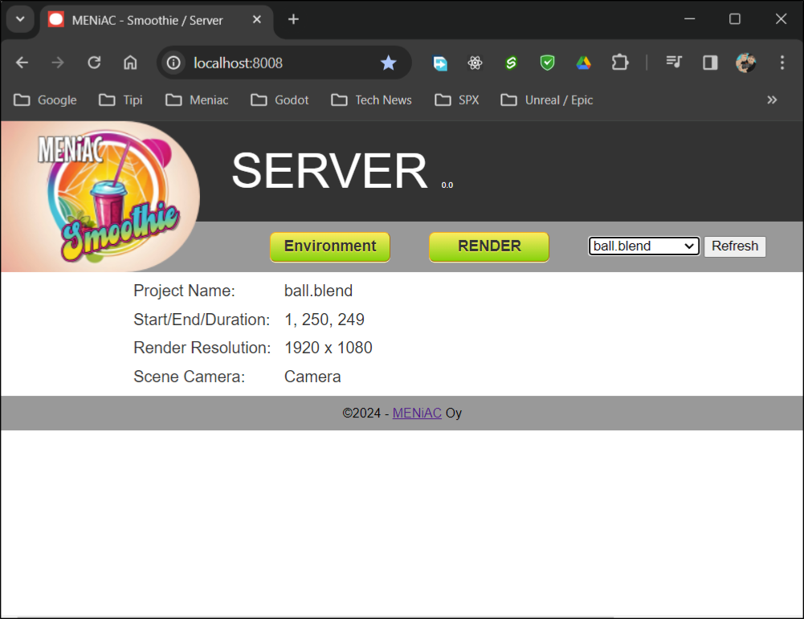
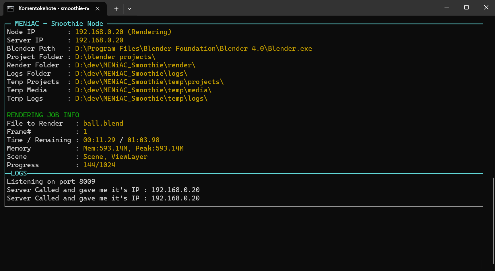

# MENiAC Smoothie
## Render Farm Solution for Blender

<br>

This project is in it's early "idea/concept" stage. At this point it doesn't actually do anything yet. This is also my first (attempt) to do NodeJs application. Everything is at this point hugely put together with bubble gum.

<BR>

## Table of Contents
- [The Server](#server)
- [The Nodes](#nodes)
- [Folder Hierarchy](#folders)
- [config.json](#configjson)
- [UI Files](#uifiles)

<BR>


<a id="server"></a>

## The Server



Runs in port 8008 by Default.

### To Start Server

- `Smoothie-server.bat` ( runs 'nodemon Smoothie-server.js' ) - Practical for development use, since nodemon restarts everytime the user updates/saves files.

- `nodemon Smoothie-server.js`

- `node Smoothie-serve.js` ( the OG way )

<BR>


<a id="nodes"></a>

## The Nodes



The Node Instanses Runs in Port 8009 by Default.

### To Start Node

- `Smoothie-node.bat` ( runs 'node Smoothie-node.js' ) - Should be using node to run, since nodemon gives error in **console-gui-tools**.

<BR>

<a id="folders"></a>

## Folder Hierarchy

- **/config/** - Contains environment and app settings file. See: [**config.json**](#configjson)

- **/modules/** - Smoohtie's Specific Modules

- **/html/** - The Servers and Nodes [operating UI](#ui)

### Server Specific Folders:
- **/logs/** - Folder for Blender Generated Logs
- **/projects/** - Folder for Blender Files. Files are transferred to Nodes as needed.
- **/render/** - Folder for rendered Images

### Nodes Specific Folders:
- **/temp/** - Root of Nodes files. Never used by itself.
- **/temp/logs/** - Folder for Blender Generated Logs
- **/temp/media/** - Folder to temporarely store rendered images. Images are transferred to server when render is done.
- **/temp/projects/** - Folder to temporarely store Blender files.

<BR>

<a id="configjson"></a>

### config.json

|Parameter|Default Value|  |
|---------|-------|--------------------|
|"version"|"0.1.3"|Not implemented yet. Purpose to populate this info for server and nodes, that can compare versions.|
|"url"|"127.0.0.1"|Not Implemented yet. Machines IP.|
|"server_port"|8008|Port that Server uses.|
|"node_port"|8009|Port that Nodes use.|
|"media_port"|8010|Obsolete. Not used anymore.|
|"blender_path"|  |Absolute Path to the Blender executable.|
|"project_folder"|".\\\\projects\\\\"|Absolute or Relative path, where the Blender files should be located.|
|"render_folder"|".\\\\render\\\\"|Absolute or Relative path, where the rendered images should be placed.|
|"logs_folder"|".\\\\logs\\\\"|Absolute or Relative path, where the Blender Generated logs should be placed.|
|"temp_projects"|".\\\\temp\\\\projects\\\\"|Absolute or Relative path for Nodes temporary location for Blender files.|
|"temp_media"|".\\\\temp\\\\media\\\\"|Absolute or Relative path for rendered images before sent to Server.|
|"temp_logs"|".\\\\temp\\\\logs\\\\"|Absolute or Relative path for Blender Generated Logs.|
|"render_engines"|"CYCLES", "BLENDER_EEVEE"|The Renderer tp be used. Others can be added. The name of the Renderer can be valuated with the -E or --engine parameter. See [Blender Command Line Arguments](https://docs.blender.org/manual/en/latest/advanced/command_line/arguments.html) for more information.   |
|"file_format"|"TGA", "RAWTGA", "JPEG",<br> "IRIS", "IRIZ", "PNG", "BMP"|These file formats that are supported on every system. Some snimations formats (i.e. "AVIRAW" or "AVIJPEG") can be added here also, but it is recommended to render image sequences.|
|"extra_formats"|"HDR", "TIFF", "OPEN_EXR",<br>"OPEN_EXR_MULTILAYER",<br>"MPEG", "CINEON", "DPX",<br>"DDS", "JP2", "WEBP"|Extra file formats that are not supported on every system. Make sure that your systems supports these before rendering.|
|"cycles_devices"|"CPU", "CUDA", "OPTIX",<br>"HIP", "ONEAPI", "METAL"|If you are using Cycles for rendering, you can select Device for it. Make sure that your system supports it.|

<BR>

Default `config.json`:
```json
{
    "version"           : "0.1.3",
    "url"               : "127.0.0.1",
    "server_port"       : 8008,
    "node_port"         : 8009,
    "blender_path"      : [Absolute Path to Blender],
    "project_folder"    : ".\\projects\\",
    "render_folder"     : ".\\render\\",
    "logs_folder"       : ".\\logs\\",
    "temp_projects"     : ".\\temp\\projects\\",
    "temp_media"        : ".\\temp\\media\\",
    "temp_logs"         : ".\\temp\\logs\\",
    "render_engines"    : ["CYCLES", "BLENDER_EEVEE"],
    "file_format"       : ["TGA", "RAWTGA", "JPEG", "IRIS", "IRIZ", "PNG", "BMP" ],
    "extra_formats"     : ["HDR", "TIFF", "OPEN_EXR", "OPEN_EXR_MULTILAYER", "MPEG", "CINEON", "DPX", "DDS", "JP2", "WEBP"],
    "cycles_devices"    : ["CPU", "CUDA", "OPTIX", "HIP", "ONEAPI", "METAL"]
}
```

<a id="ui"></a>

## Operating UI

```
Folder hierarchy:

⏷ html
   ┝━━ node_ui.html
   ┝━━ server_ui.html
   ┝━⏷ /img/
   ┝━⏷ /css/
   |    ┝━━ node.css
   |    ┝━━ server.css
   |    ┕━━ smoothie.css
   ┕━⏷ /js/
        ┝━━ node_ui.js
        ┝━━ server_ui.js
        ┕━━ smoothie.js
```


---


### Version 0.1.0

Nodes and Server can talk to each other. They both have config.json file to keep
directories etc.